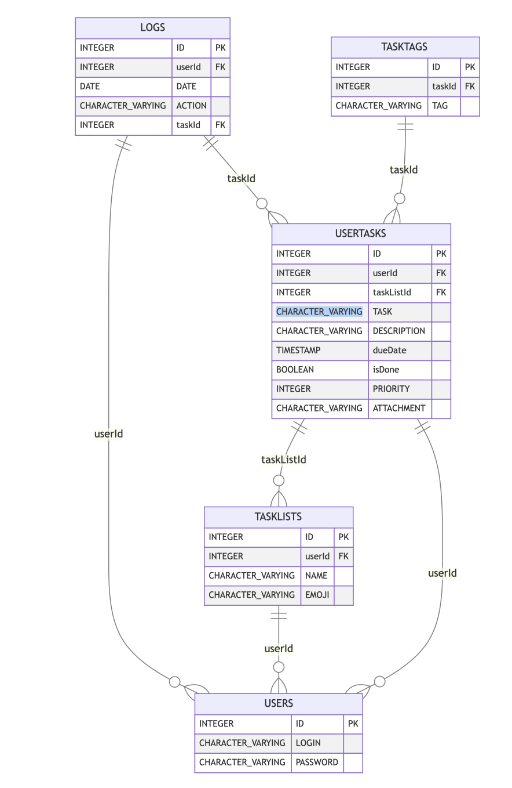

# Выступление

## Актуальность темы

Разрешите представить вам дипломный проект на тему "Разработка мобильного приложения 'Планировщик задач'". 
В настоящее время большинство приложений для проектной работы и ведения личных дел сталкиваются с рядом ограничений, 
таких как централизация системы, что означает полную зависимость пользователей от разработчика, частичная или полная 
закрытость системы, что делает невозможным внедрение новых функций и возможностей самостоятельно (персонализация), 
а также коммерциализация сервисов, что приводит к появлению или увеличению цен, введению платных подписок и услуг, 
и отвлекает пользователей от основной цели использования.

Эти проблемы можно решить, создав систему, которая акцентирует внимание на принципах децентрализованности и открытости, 
а также ставит в приоритет безопасность и неприкосновенность данных пользователей. 
Именно такой системой является проект Uptask. 

Он позволяет вести свои дела, не отвлекаясь на рекламу, не беспокоясь о качестве интернет-связи или о внезапном 
закрытии проекта, и не переживая о безопасности своих данных. 

Uptask полностью локален, все данные хранятся непосредственно на устройстве пользователя, 
а исходный код проекта полностью открыт и позволяет персонализировать систему под свои нужды.

Помимо этого, актуальной является и сама сфера планирования для любого пользователя - 
она пользуется большим спросом в современном мире, где время является самым ценным ресурсом, а информационный шум зашкаливает.

Планирование своей жизни и её структуризация решает проблемы рассеянности, забывчивости, 
помогает распределять приоритеты задач, проводить самоанализ и саморазвитие.

## Постановка задачи

Основной задачей дипломного проекта является разработка мобильного приложения планировщика задач 
с расширенным функционалом категоризации, сортировки, группировки задач.

Основные этапы включают проектирование и разработку архитектуры приложения, создание 
удобного пользовательского интерфейса, обеспечение безопасности данных и 
проведение тестирования для оценки качества работы приложения.

## Среды программирования

Для разработки приложения Uptask были использованы следующие среды программирования:

- **Язык программирования Kotlin**: Kotlin – это современный статически типизированный язык программирования, разработанный компанией JetBrains, который широко используется для разработки Android-приложений благодаря своей лаконичности, безопасности и интероперабельности с Java.

- **Фреймворк Jetpack Compose**: Jetpack Compose – это современный инструмент для создания пользовательского интерфейса от Google, который упрощает и ускоряет процесс разработки UI за счет декларативного подхода и интеграции с Kotlin.

- **База данных H2**: H2 Database – это легковесная встроенная реляционная база данных, которая обеспечивает локальное хранение данных на устройстве пользователя, не требуя отдельного серверного процесса, что делает её идеальной для мобильных приложений.

- **Android SDK**: Android Software Development Kit (SDK) – это набор инструментов и библиотек от Google, которые предоставляют разработчикам средства для создания, тестирования и отладки приложений на платформе Android.

- **Android Studio**: Android Studio – это официальная интегрированная среда разработки (IDE) для Android от Google, которая предоставляет мощные инструменты для редактирования кода, отладки, тестирования и анализа производительности, а также тесную интеграцию с Android SDK и Kotlin.

> Каждая из этих технологий играет ключевую роль в обеспечении функциональности, производительности и безопасности приложения Uptask. Kotlin обеспечивает надежность и простоту кода, Jetpack Compose ускоряет разработку интерфейса, H2 надежно хранит данные локально, Android SDK предоставляет необходимые библиотеки и инструменты, а Android Studio объединяет все эти компоненты в удобной и мощной среде разработки.

## Функции приложения

Приложение Uptask включает в себя следующие основные функции:

#### 1. Регистрация и аутентификация пользователей
- **Регистрация нового пользователя**: Пользователи могут создать новый аккаунт, предоставив необходимые данные, такие как логин и пароль.
- **Аутентификация**: Есть возможность войти в приложение, используя свои учетные данные. Аутентификация обеспечивает безопасность и доступ к своей информации.

#### 2. Управление списками задач
- **Создание списков задач**:  Создание новых списков задач, которые помогут им организовывать свои дела по категориям или проектам.
- **Редактирование списков задач**: Возможность изменять название и эмодзи списков задач, если это требуется.
- **Удаление списков задач**: Пользователи могут удалять ненужные списки задач, чтобы поддерживать актуальность своей информации.

#### 3. Управление задачами
- **Создание задач**: Пользователи могут добавлять новые задачи в любой из своих списков. При создании задачи можно указать её название, описание, дату выполнения, приоритет, и если требуется - установить напоминание.
- **Редактирование задач**: Возможность изменять детали задач, такие как название, описание, дату выполнения, приоритет и статус выполнения при её обновлении.
- **Удаление задач**: Пользователи могут удалять задачи, которые больше не актуальны.
- **Установка статуса выполнения**: Пользователи могут отмечать задачи как выполненные или невыполненные, что помогает отслеживать прогресс.

#### 4. Управление тегами
- **Добавление тегов к задачам**: Пользователи могут присваивать теги задачам для лучшей организации и поиска.
- **Удаление тегов**: Пользователи могут удалять ненужные теги.

#### 5. Журналирование действий
- **Отслеживание изменений**: Приложение сохраняет историю изменений задач, таких как создание, редактирование и удаление, что позволяет отображать статистику.

#### 6. Напоминания и уведомления
- **Установка напоминаний**: Пользователи могут устанавливать напоминания для задач, чтобы не забывать о важных делах.
- **Получение уведомлений**: Приложение отправляет уведомления пользователям, когда наступает время выполнения задачи или за определенное время до этого.

#### 7. Интерфейс пользователя
- **Простота и удобство использования**: Приложение предлагает интуитивно понятный интерфейс, который позволяет пользователям легко создавать, редактировать и управлять своими задачами.

#### 8. Безопасность данных
- **Хранение данных**: Все пользовательские данные хранятся в локальном кеше приложения, что обеспечивает безопасность и конфиденциальность.

#### 9. Доступность и офлайн-режим
- **Работа в офлайн-режиме**: Приложение позволяет пользователям управлять своими задачами даже без подключения к интернету. Все изменения синхронизируются при восстановлении подключения.

Эти функции делают Uptask мощным инструментом для управления задачами, обеспечивая пользователям гибкость, безопасность и удобство в повседневной жизни и работе.

Основные исходные данные включают в себя следующее.
1. Пользовательские данные:
  - Логин: Имя пользователя, используемое для входа в систему;
  - Пароль: Секретная комбинация символов для доступа к аккаунту.

2. Данные задач:
  - Название задачи: Краткое описание или заголовок задачи;
  - Описание задачи: Детальное описание того, что нужно выполнить;
  - Дата выполнения: Срок, к которому задача должна быть выполнена;
  - Приоритет: Важность задачи по сравнению с другими задачами;
  - Статус выполнения: указывает, выполнена задача или нет;
  - Напоминание (за сколько времени до срока напомнить).

3. Данные списков задач:
  - Название списка: Название, идентифицирующее список задач.
  - Эмодзи или иконка: Графический символ, ассоциирующийся со списком.
  - Задачи: Ссылки на задачи, включенные в список.

4. Данные для аналитики:
  - Дата начала периода: Начало временного промежутка для анализа.
  - Дата окончания периода: Конец временного промежутка для анализа.

Выходные данные это сами задачи, их отображение на экране, аналитическая информация.

## Схема базы данных

Основные сущности созданной базы данных, а также связи между ними представлены на следующем рисунке:

Схема базы данных приложения Uptask включает несколько таблиц, каждая из которых отвечает за определенные аспекты работы с задачами и пользователями. Ниже приведено описание основных таблиц и их взаимосвязей:

- **Пользователи (Users)**: Эта таблица хранит информацию о пользователях приложения. Включает поля: `ID` (идентификатор пользователя, первичный ключ), `LOGIN` (логин пользователя) и `PASSWORD` (пароль). Эта таблица является основной для всех данных, связанных с пользователями.

- **Списки задач (TaskLists)**: Таблица списков задач хранит информацию о различных проектах, создаваемых пользователями. Включает поля: `ID` (идентификатор списка, первичный ключ), `userId` (идентификатор пользователя, внешний ключ), `NAME` (название списка) и `EMOJI` (эмодзи для визуальной идентификации списка). Связана с таблицей пользователей по полю `userId`, что позволяет хранить списки задач конкретных пользователей.

- **Пользовательские задачи (UserTasks)**: Таблица задач хранит информацию о всех задачах, создаваемых пользователями. Включает поля: `ID` (идентификатор задачи, первичный ключ), `userId` (идентификатор пользователя, внешний ключ), `taskListId` (идентификатор списка задач, внешний ключ), `TASK` (название задачи), `DESCRIPTION` (описание задачи), `dueDate` (срок выполнения), `isDone` (статус выполнения), `PRIORITY` (приоритет задачи). Связана с таблицами пользователей и списков задач по полям `userId` и `taskListId`, что позволяет отслеживать задачи конкретных пользователей и их проектов.

- **Теги задач (TaskTags)**: Эта таблица хранит теги, связанные с задачами. Включает поля: `ID` (идентификатор тега, первичный ключ), `taskId` (идентификатор задачи, внешний ключ) и `TAG` (текст тега). Связана с таблицей задач по полю `taskId`. Так как у одной задачи может быть несколько тегов, они были вынесены в отдельную таблицу.

- **Логи (Logs)**: Таблица логов хранит историю изменений, внесенных в задачи. Включает поля: `ID` (идентификатор лога, первичный ключ), `userId` (идентификатор пользователя, внешний ключ), `taskId` (идентификатор задачи, внешний ключ), `DATE` (дата изменения) и `ACTION` (тип изменения: создание, обновление, удаление). Связана с таблицами пользователей и задач по полям `userId` и `taskId`, что позволяет отслеживать изменения, сделанные конкретными пользователями в конкретных задачах, а также позволяет собирать статистику по ним и отображать в соответствующем разделе.

> Эти таблицы вместе обеспечивают функциональность приложения Uptask, позволяя пользователям управлять своими задачами, добавлять теги для лучшей организации и анализировать свою продуктивность. Связи между таблицами обеспечивают целостность данных и позволяют выполнять сложные запросы для анализа и отображения информации. Каждая задача принадлежит своему списку, а список пользователю, таким образом соблюдается третья нормальная форма.

## Структура приложения

Приложение Uptask состоит из следующих основных компонентов:

- Модуль управления задачами: отвечает за создание, редактирование, удаление и сортировку задач.
- Модуль напоминаний: обеспечивает установку и управление напоминаниями для задач.
- Модуль аналитики: генерирует отчеты о выполнении и невыполнении задач.
- Модуль профиля пользователя: позволяет изменять логин и пароль пользователя, а также удаление БД.
- Модуль экспорта: моментальный экспорт данных в читаемый другими программами формат.

## Интерфейс приложения

Далее представлены скриншоты интерфейса приложения.

[РИСУНОК]

## Обеспечение защиты

Безопасность данных пользователей является одним из ключевых аспектов приложения Uptask. Для обеспечения защиты были предприняты следующие меры:

- Все данные хранятся локально на устройстве пользователя и не передаются через интернет.
- Система аккаунтов с обязательной авторизацией для доступа к функционалу

В результате, проект Uptask представляет собой современное и безопасное решение для управления задачами, которое решает множество проблем, присущих существующим аналогам, и обеспечивает пользователям высокую степень контроля и безопасности их данных.
