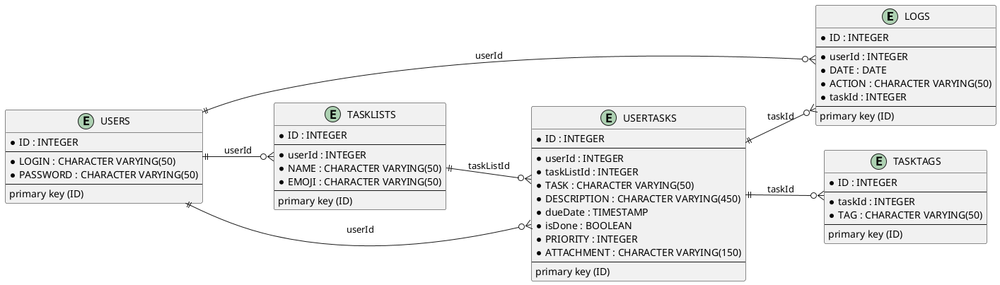

# Диаграммы

Диаграмма связей между таблицами

```plantuml
@startuml

left to right direction

entity LOGS {
    * ID : INTEGER
    --
    * userId : INTEGER
    * DATE : DATE
    * ACTION : CHARACTER VARYING(50)
    * taskId : INTEGER
    --
    primary key (ID)
}

entity TASKLISTS {
    * ID : INTEGER
    --
    * userId : INTEGER
    * NAME : CHARACTER VARYING(50)
    * EMOJI : CHARACTER VARYING(50)
    --
    primary key (ID)
}

entity TASKTAGS {
    * ID : INTEGER
    --
    * taskId : INTEGER
    * TAG : CHARACTER VARYING(50)
    --
    primary key (ID)
}

entity USERS {
    * ID : INTEGER
    --
    * LOGIN : CHARACTER VARYING(50)
    * PASSWORD : CHARACTER VARYING(50)
    --
    primary key (ID)
}

entity USERTASKS {
    * ID : INTEGER
    --
    * userId : INTEGER
    * taskListId : INTEGER
    * TASK : CHARACTER VARYING(50)
    * DESCRIPTION : CHARACTER VARYING(450)
    * dueDate : TIMESTAMP
    * isDone : BOOLEAN
    * PRIORITY : INTEGER
    * ATTACHMENT : CHARACTER VARYING(150)
    --
    primary key (ID)
}

USERS ||--o{ LOGS : "userId"
USERTASKS ||--o{ LOGS : "taskId"
USERS ||--o{ TASKLISTS : "userId"
USERTASKS ||--o{ TASKTAGS : "taskId"
TASKLISTS ||--o{ USERTASKS : "taskListId"
USERS ||--o{ USERTASKS : "userId"

@enduml
```

